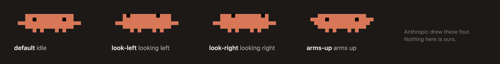

# clawd-statusline

Clawd — the mascot that already ships inside Claude Code — standing in your status line, reacting to how much room you have left. **It keeps whatever status line you already run**, so it costs you nothing to add.

```
 ▐▛███▛█   [Opus] │ my-project git:(main*)
▝▜██████▀  Context ██░░░░░░░░ 22% │ Usage ███░░░░░░░ 30%
  ▝▝ ▝▝    1 CLAUDE.md
```



## It wraps, it doesn't replace

Claude Code allows exactly one status line command, so a mascot that took that slot would cost you whatever you already run there. This one doesn't. It takes your existing command, feeds it the same stdin JSON, and prints its output to the right of the sprite. `/clawd-statusline:setup` moves your current status line into the `wrap` setting for you.

With nothing configured it goes looking, and takes the first of these it finds:

| Status line | What it looks for | What it runs |
|---|---|---|
| [claude-hud](https://github.com/jarrodwatts/claude-hud) | the plugin in your cache | `node .../dist/index.js` |
| [ccstatusline](https://github.com/sirmalloc/ccstatusline) | the `ccstatusline` binary, else `~/.config/ccstatusline/settings.json` | `ccstatusline`, else `npx -y ccstatusline@latest` |
| [claude-powerline](https://github.com/Owloops/claude-powerline) | `~/.claude/claude-powerline.json` | `npx -y @owloops/claude-powerline@latest` |
| [ccusage](https://ccusage.com/guide/statusline) | the `ccusage` binary | `ccusage statusline` |

An installed binary is always preferred over `npx`. A package only gets pulled through `npx` when
you have actually configured it — having `npx` on your PATH is not on its own a reason to spend a
few seconds a turn on a tool you don't use. Set `wrap` yourself and none of this runs.

With none of them, Clawd stands alone.

## Nothing to install

No hooks, no daemon, no database. The plugin is one Python script. Everything Clawd knows he
reads from the payload Claude Code already hands the status line, and from the tail of the
transcript that is already on disk. The only thing written is scratch: the wrapped command's
last output and a few bytes recording what you last did, both under `clawd-cache/`. Delete that
directory whenever you like.

There used to be a card here: a level from the tokens you had spent, five stats scored out of
your own history. It is gone. Usage dashboards for Claude Code are a crowded shelf, and a
mascot that also keeps a ledger is a worse version of both. `docs/discarded.md` is the record of
everything tried and dropped — three creature designs, a wardrobe, extra faces, and the card —
so nobody has to find out the same way twice.

## Install

```
/plugin marketplace add byjunyoung/clawd-statusline
/plugin install clawd-statusline
/clawd-statusline:setup
```

Or from the shell:

```bash
claude plugin marketplace add byjunyoung/clawd-statusline
claude plugin install clawd-statusline@clawd-statusline
```

Needs Python 3.9+, standard library only. The status line takes effect on the next Claude Code start.

## Poses

The pose follows whichever is worse — context headroom or rate-limit headroom.

| Remaining | What Clawd does |
|---|---|
| above 50% | mostly stands still, glances left or right now and then |
| 50–25% | glances far more often — restless rather than calm |
| 25–10% | arms up much of the time |
| below 10% | arms up and down every second |

**Only Anthropic's four original poses are used.** Earlier versions drew extra faces — a mouth, a
blink — and that is exactly what made it look like a knock-off. Nothing new is drawn; how worried
Clawd is comes out of which of the four appears and how often.

Movement comes from `refreshInterval: 1`, which re-runs the status line once a second. Drop that key from `settings.json` for a still sprite.

## What Clawd reacts to

A status line never sees your keyboard. Claude Code hands it a JSON payload on stdin and redraws
it on a fixed set of events; the terminal's key and mouse events belong to Claude Code itself.
So everything below is inferred from that payload and from the tail of the transcript — no hooks,
nothing to install.

| You do | How Clawd knows | What he does |
|---|---|---|
| send a prompt | a typed user message appears | crouch, leap, land — one tick each |
| press Esc to stop | `[Request interrupted by user]` lands in the transcript | throws his arms up and freezes for two ticks |
| leave a tool running | the last tool call still has no result | glances around more — one band up from wherever headroom put him |
| walk away | the transcript stops changing for a minute | drops into the loop the original plays when nothing is happening |

```
   crouch        jump        land           idle: 12 ticks, then one glance each way

                ▗▟▛███▛█▄    ▐▛███▛█        ▐▛███▛█    ▐█▟███▟    ▐▟███▟█
  ▐▛███▛█        ▜██████▘   ▝▜██████▀       ▝▜██████▀  ▝▜██████▀  ▝▜██████▀
 ~▜██████~        ▝▝ ▝▝       ▝▝ ▝▝           ▝▝ ▝▝      ▝▝ ▝▝      ▝▝ ▝▝
```

Every frame above is one Anthropic already ships, and so is the pairing. Across the original's
six sequences only five (pose, vertical offset) combinations ever occur, and a dropped body is
only ever paired with `default` — so an interrupt gets `arms-up` standing, not ducking. The dust
is not decoration either: crouching clips a column off each end of the body, and those two
characters are what fill the gap. `tests/test_poses.py` fails if a frame outside that set is
emitted, or if dust appears without a crouch.

Going quiet does not invent a resting pose. It hands over to the loop the original itself plays
when idle — twelve ticks facing forward, five glancing right, five glancing left, repeating. The
tell is not the posture, it is that Clawd stops moving at random and falls into a regular rhythm.

Claude Code's own Clawd hops when you click him, playing twelve frames at 60ms. A status line
cannot: `refreshInterval` is capped at one second
([#80290](https://github.com/anthropics/claude-code/issues/80290)), so the hop is compressed to
three, triggered by the closest thing the payload can see — you sending a prompt.

**What is not possible.** Keystrokes never arrive; `vim.mode` is the single exception, since it is
in the payload and toggling it forces a redraw. Nothing can be shown during a permission prompt,
the help menu or autocomplete, because Claude Code hides the status line while those are up. And
switching permission mode triggers a redraw without saying which mode you switched to.

The transcript tail is read only when the file's size or mtime changes, so a session sitting idle
costs one `stat` per tick. Measured at 0.027s a run against a 6MB transcript, the same as before
any of this existed.

## Configuration

Everything is optional. Create `~/.claude/clawd-statusline.json` (or under `$CLAUDE_CONFIG_DIR`) with only the keys you want to change, or run `/clawd-statusline:configure`.

| Key | Default | Meaning |
|---|---|---|
| `wrap` | auto-detect | Command whose output renders to the right. A string runs through the shell, an array runs directly. |
| `gap` | `2` | Blank columns between sprite and wrapped output. |
| `thresholds` | `{"wary": 50, "alarmed": 25, "panic": 10}` | Where the pose changes. Higher means Clawd worries earlier. |
| `jump` | `true` | Hop for three ticks after you send a prompt. |
| `startle` | `true` | Flinch for two ticks after you interrupt with Esc. |
| `busy` | `true` | Glance around more while a tool is still running. |
| `idle` | `60` | Fall into the original's idle loop after this many quiet seconds. `0` never does. |

```json
{
  "wrap": ["/usr/local/bin/node", "/path/to/your/statusline.js"],
  "gap": 3,
  "thresholds": { "wary": 60, "alarmed": 30, "panic": 15 },
  "jump": false,
  "idle": 0
}
```

## Terminals

Truecolor terminals get the sprite in Clawd's own `rgb(215,119,87)`. Elsewhere it falls back to ANSI bright red on black, the same pair Claude Code's own ANSI theme uses. Apple Terminal renders quadrant blocks differently, so it gets the alternate silhouette Claude Code carries for exactly that case — body painted as background, eyes punched through in the foreground.

Windows is untested. Two things are known: the shebang won't run, so set the command to `python <path>`, and the legacy console host doesn't accept ANSI.

## Cost

The wrapped command's output is cached under `clawd-cache/`, keyed partly on the transcript's size and mtime. A once-a-second timer re-run therefore hits the cache instead of spawning your status line process again — measured at 0.10s cold, 0.02s warm against claude-hud.

## Uninstall

`/clawd-statusline:setup` backs up `settings.json` before it writes; restore that file and remove the plugin.

## Where Clawd comes from

Clawd is Anthropic's, not mine. The character, its four poses, the terminal fallbacks, the dust characters and the frame vocabulary are all reproduced from Claude Code's own renderer, where the sprite is drawn as quadrant blocks over a black field so the unfilled quadrants read as eyes. Nothing has been added to the character itself.

For the record, this is the whole of what the original animates (2.1.260):

```
jump       crouch·  crouch~  arms-up ×3  default    (that pair again)   12 frames, 60ms each
look       look-right ×5  look-left ×5  default
idle       default ×12  look-right ×5  look-left ×5
spin       look-left ×2  look-right ×2  look-left ×2  arms-up ×3  default
celebrate  jump, then crouch ×3 with no dust
skip       the same beats while sliding in from nine columns left
```

Anthropic has never documented the character, and requests to make the CLI avatar configurable were closed as `not_planned`. This project is not affiliated with or endorsed by Anthropic.

## License

MIT
